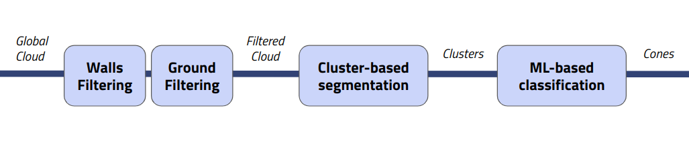

# **EC-thor**

**EC-thor** is a high-performance module implemented in **C++** and designed
to run on **ROS**, developed for the **[BCNeMotorsport](https://bcnemotorsport.upc.edu)** autonomous pipeline. Its primary focus is cone detection for a Formula Student car, leveraging **Fast Euclidean Clustering (FEC)** to accurately identify distinct cones in a highly detailed point cloud map. The module is built using the **Point Cloud Library (PCL)**, ensuring efficient processing of 3D LiDAR data in real-time. 

This system has been **over-optimized** for a specific use case: detecting cones for the **Velodyne VLP-32C** LiDAR sensor. EC-thor works in conjunction with the **[LIMO-Velo](https://github.com/Huguet57/LIMO-Velo)** SLAM algorithm. As a result, all incoming LiDAR frames are processed directly in a global reference frame, with precise odometry estimates for each frame.


| FSG24 Trackdrive Cones Track | Fòrum Testing Track |
|:----------------------------:|:-------------------:|
|  |  |


In addition to the core functionality, a more detailed and in-depth explanation of the module can be found in the Bachelor's Degree Thesis: **["Enhancing Cone Detection in the Perception System of a Formula Student Car"](../doc/MorenoVictorTFG.pdf)**. This document delves into the technical implementation, challenges, and results obtained during the development of this system, offering valuable insights into the improvements achieved through this work.

## Pipeline

The EC-thor pipeline performs cone detection using a three-step strategy: filtering, segmentation, and classification.

<p align="center">
  <br />
    EC-thor conceptual pipeline
</p>

For the first step, both walls and ground are filtered out from the point cloud. Then, the filtered global LiDAR frame is saved in a points buffer, creating a high-quality map of the environment. Afterward, the map is segmented using Fast Euclidean Clustering (FEC) to identify the cones. Finally, the found clusters are classified as cones or not cones using a Decision Tree, previously trained with a dataset of labeled cones. Additionally, as an optional step, before classification, the found clusters can be retrieved from a map of the total accumulated data stored in the ikdTree.

## Structure

The code follows a modular structure and object-oriented programming paradigm. The pipeline is implemented as a series of classes, where each class represents a stage of the pipeline. The modules are:

- **[Manager](include/modules/Manager.hpp)**: Main class that orchestrates the full pipeline. In addition to coordinating the flow of data between different modules, the Manager is responsible for receiving and publishing all the ROS messages, acting as the central communication node of the system.

- **[Processor](include/modules/Processor.hpp)**: Filters the point cloud to remove walls and ground. It processes the incoming LiDAR frame before accumulating it in a map of the circuit. This module operates synchronously every time a new `PointCloud` is received, ensuring that only relevant information is passed along to the next stages.

- **[Accumulator](include/modules/Accumulator.hpp)**: Stores the filtered point cloud in a buffer with a predefined maximum number of points. This buffer acts as a temporary storage for all the processed frames from the `Processor`, enabling efficient access to the point cloud data during the clustering and classification stages.

- **[Detector](include/modules/Detector.hpp)**: Segments the point cloud using Fast Euclidean Clustering (FEC). This module operates asynchronously at 10Hz and accesses the buffer managed by the `Accumulator`. It performs clustering on the buffered data and proceeds with the classification of clusters to determine if they represent cones or other objects.

- **[Reconstructor](include/modules/Reconstructor.hpp)**: Reconstructs the segmented clusters in the global frame. This module can be optionally called to update the ikdTree with an unfiltered, complete map of the circuit. Its main responsibility is to reconstruct the clusters obtained by the `Detector`.


## Configuration and Tuning Parameters

The behavior and performance of EC-thor can be customized by adjusting various parameters within the `config/params.yaml` file. Below is a brief description of some of the most important parameters:

- **Manager**: The `reconstruct` parameter controls whether the system should reconstruct the clusters using an ikdTree. This option can be disabled to improve performance in scenarios where the full map is not required. 
  ```yaml
  manager:
    reconstruct: false  # True: Reconstruction of clusters through an ikdTree
  ```

- **Accumulator Parameters**: These parameters control how the point cloud frames are stored and filtered before clustering. The **buffer size** defines the maximum number of points the accumulator can store, and the **filter** options allow limiting the points based on a defined radius and field of view.
  ```yaml
  accumulator:
    buffer_size: 50000  # Maximum size of the buffer
    filter: true  # True: Apply a filter to the buffer / False: Do not filter the buffer
    radius: 50  # Filter radius (meters)
    field_of_view: 160  # Field of view for filtering [-fov/2, fov/2] in degrees
  ```

- **Clustering Hyperparameters**: These parameters control the clustering algorithm, including the search radius (`eps`) for finding points within a cluster and the minimum/maximum number of points allowed in a cluster.
  ```yaml
  detect:
    hiperparams:
      eps: 0.25  # Search radius for clustering
      maxPts: 1000  # Maximum points in a cluster
      minPts: 4  # Minimum points in a cluster
  ```


## References

- [Bachelor’s Degree Thesis](https://github.com/YizhenLAO/FEC): Enhancing Cone Detection in the Perception System of a Formula Student Car
- [FEC](https://github.com/YizhenLAO/FEC): Fast Euclidean Clustering for Point Cloud Segmentation
- [ikd-Tree](https://github.com/hku-mars/ikd-Tree): Incremental KD-Tree for Robotic Applications

